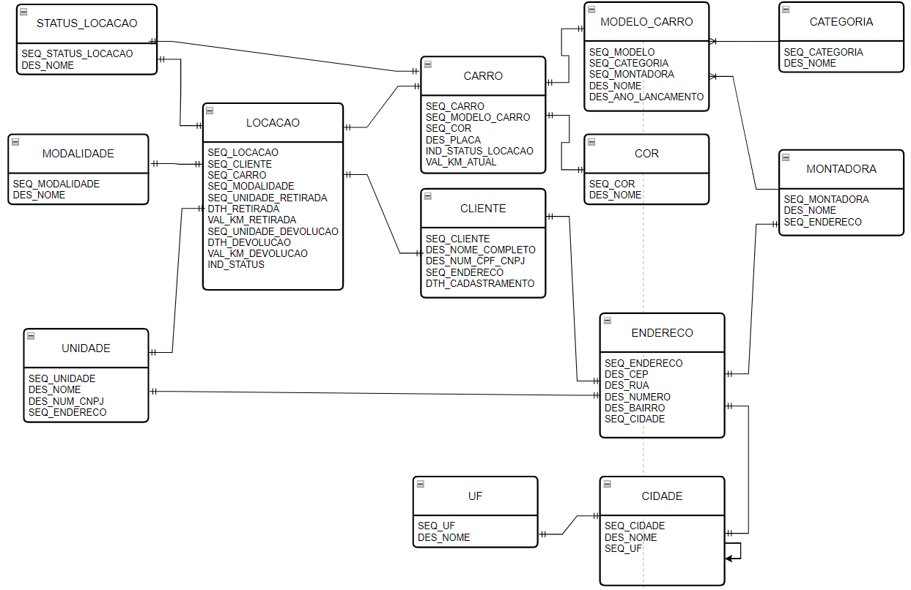

 
    <h1>
        Módulo 03 - Projeto Carloca - Bootcamp Back-End Ada Tech
    </h1>

<h4>
    Projeto final do Módulo 3 - Banco de Dados - Bootcamp de Back-End Ada Tech em parceria com o Ifood
</h4>

 
    <h2>
    Sobre o projeto
    </h2>

    
 Este projeto diz respeito a modelagem de banco feita com o intuito de atender as especificações do Carloca. 

 
    <h2>
    Entidades
    </h2>

> ## MODALIDADE

- `SEQ_MODALIDADE:`Representa a chave primária da tabela MODALIDADE; 
- `DES_NOME:` Representa um campo descritivo do nome da modalidade.

> ## STATUS_LOCACAO
- `SEQ_STATUS_LOCACAO:`Representa a chave primária da tabela STATUS_LOCACAO;  
- `DES_NOME:` Representa um campo descritivo do nome do status da locação.

> ## UNIDADE
- `SEQ_UNIDADE:`Representa a chave primária da tabela UNIDADE;
- `DES_NOME:`Representa um campo descritivo do nome da unidade da Carloca;
- `DES_NUM_CNPJ:`Representa um campo de CNPJ referente a unidade da Carloca;
- `SEQ_ENDERECO:`Representa a chave estrangeira da tabela ENDERECO;

> ## LOCACAO
- `SEQ_LOCACAO:`Representa a chave primária da tabela LOCACAO;
- `SEQ_CLIENTE:`Representa a chave estrangeira da tabela CLIENTE;
- `SEQ_CARRO:`Representa a chave estrangeira da tabela CARRO;
- `SEQ_MODALIDADE:`Representa a chave estrangeira da tabela MODALIDADE;
- `SEQ_UNIDADE_RETIRADA:`Representa a chave estrangeira da tabela UNIDADE, referente a unidade de retirada do carro locado;
- `DTH_RETIRADA:`Representa a data e hora de retirada do carro locado;
- `VAL_KM_RETIRADA:`Representa a quilometragem já rodada pelo carro locado no ato da retirada;
- `SEQ_UNIDADE_DEVOLUCAO:`Representa a chave estrangeira da tabela UNIDADE, referente a unidade de devolução do carro locado;
- `DTH_DEVOLUCAO:`Representa a data e hora de devolução do carro locado;
- `VAL_KM_DEVOLUCAO:`Representa a quilometragem já rodada pelo carro locado no ato da devolução;
- `IND_STATUS:`Representa o valor da chave estrangeira da tabela STATUS_LOCACAO;

> ## CARRO

- `SEQ_CARRO:`Representa a chave primária da tabela CARRO;
- `SEQ_MODELO_CARRO:`Representa a chave estrangeira da tabela MODELO_CARRO;
- `SEQ_COR:`Representa a chave estrangeira da tabela COR;
- `DES_PLACA:`Representa o número da placa do carro;
- `IND_STATUS_LOCACAO:`Representa o valor da chave estrangeira da tabela STATUS_LOCACAO;
- `VAL_KM_ATUAL:`Representa a quilometragem total rodada até o momento pelo carro;

> ## CLIENTE

- `SEQ_CLIENTE:`Representa a chave primária da tabela CLIENTE;
- `DES_NOME_COMPLETO:`Representa o nome completo do cliente PF ou PJ;
- `DES_NUM_CPF_CNPJ:`Representa o número do documento do cliente;
- `SEQ_ENDERECO:`Representa a chave estrangeira da tabela ENDERECO;
- `DTH_CADASTRAMENTO:`Representa a data e hora de cadastramento do cliente;

> ## UF

- `SEQ_UF:`Representa a chave primária da tabela UF;
- `DES_NOME:`Representa um campo descritivo do nome da UF;

> ## MODELO_CARRO

- `SEQ_MODELO_CARRO:`Representa a chave primária da tabela MODELO_CARRO;
- `SEQ_CATEGORIA:`Representa a chave estrangeira da tabela CATEGORIA;
- `SEQ_MONTADORA:`Representa a chave estrangeira da tabela MONTADORA;
- `DES_NOME:`Representa um campo descritivo do nome do modelo de carro;
- `DES_ANO_LANCAMENTO:`Representa um campo descritivo do ano de lançamento do modelo de carro;

> ## COR 
- `SEQ_COR:` Representa a chave primária da tabela COR; 
- `DES_NOME:`Representa o campo descritivo da nome da cor;

> ## ENDERECO
- `SEQ_ENDERECO:`Representa a chave primária da tabela ENDERECO;
- `DES_CEP:`Representa o campo descritivo do  número de CEP do endereço;
- `DES_RUA:`Representa o campo descritivo da rua do endereço;
- `DES_NUMERO:`Representa o campo descritivo do número do endereço;
- `DES_BAIRRO:`Representa o campo descritivo do nome do bairro do endereço;
- `SEQ_CIDADE:`Representa a chave estrangeira da tabela CIDADE;

> ## CIDADE
- `SEQ_CIDADE:`Representa a chave primária da tabela CIDADE; 
- `DES_NOME:`Representa o campo descritivo do nome da cidade;
- `SEQ_UF:`Representa chave estrangeira da tabela UF;

> ## CATEGORIA 
- `SEQ_CATEGORIA:`Representa a chave primária da tabela CATEGORIA;
- `DES_NOME:`Representa o campo descritivo do nome da categoria;

> ## MONTADORA
- `SEQ_MONTADORA:`Representa a chave primária da tabela MONTADORA; 
- `DES_NOME:`Representa o campo descritivo do nome da montadora;
- `SEQ_ENDERECO:`Representa a chave estrangeira da tabela ENDERECO;

